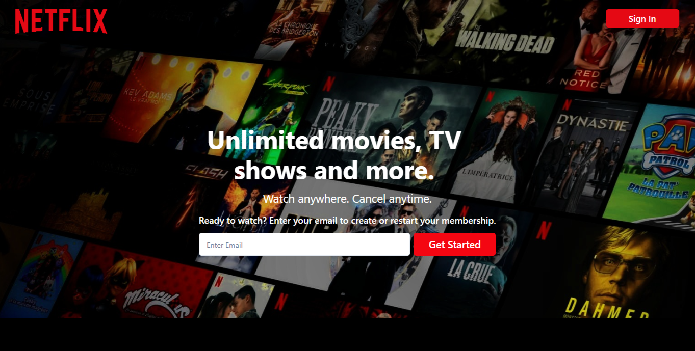
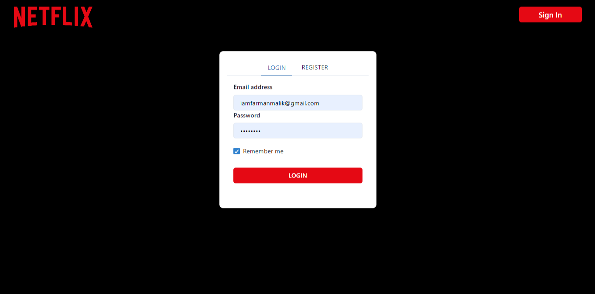
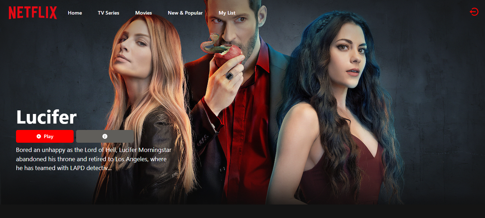
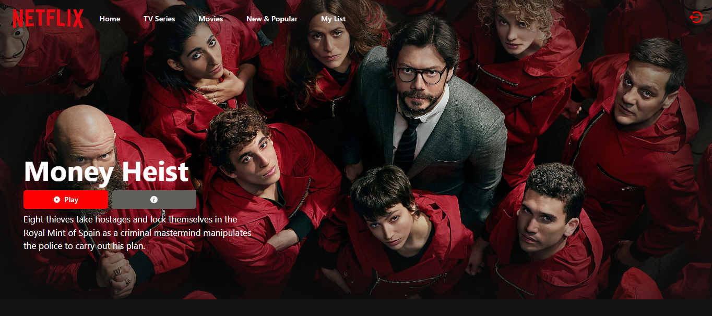
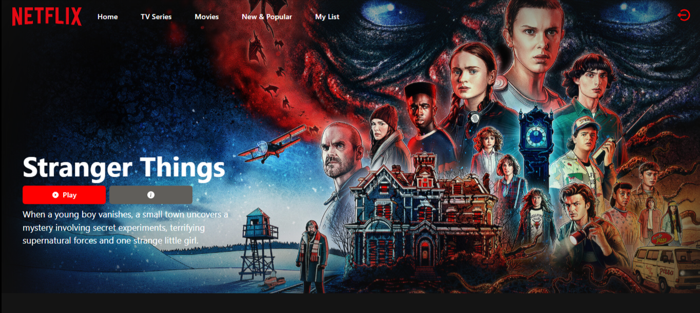
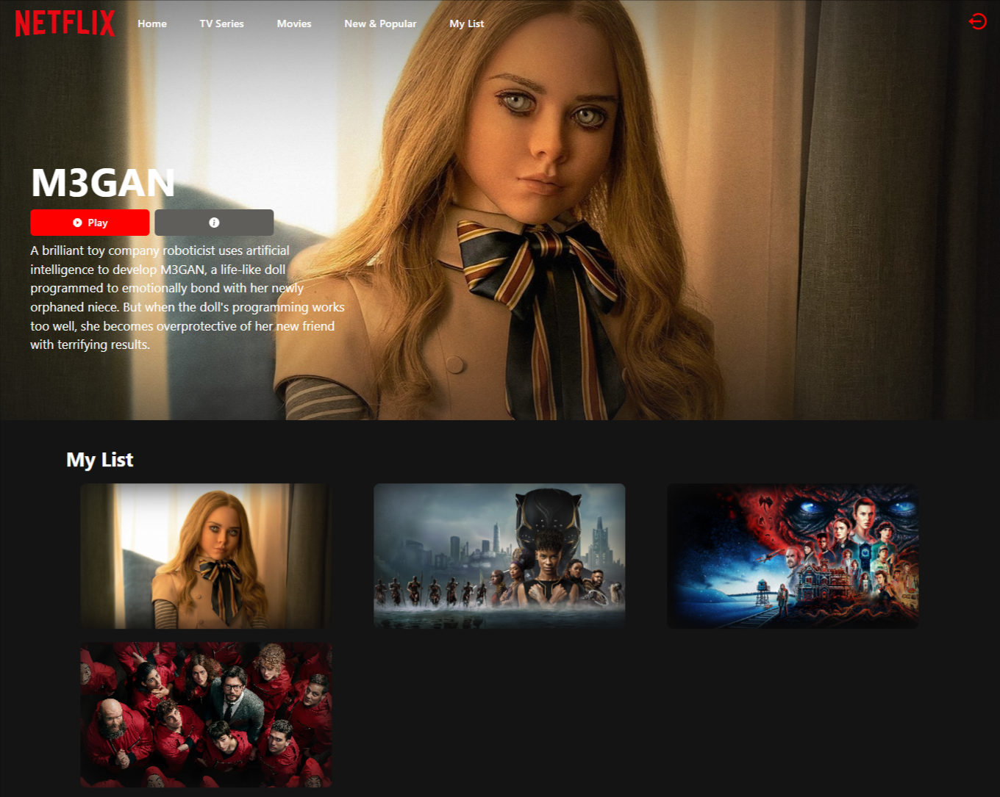
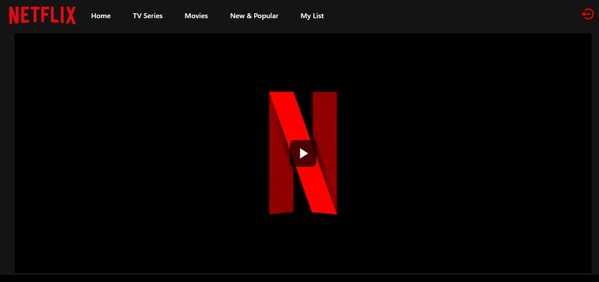

<h1 align="center">NETFLIX CLONE</h1>

<h3 align="center">It's Full Stack Netflix Clone </h3>

 

<h2 align="center">🖥️ Tech Stack</h2>

<h4 align="center">Frontend:</h4>

  
  
  
  
  
  
  

<h4 align="center">Backend:</h4>

  
  
  

<h4 align="center">Deployed On:</h4>

  
 

<h3 align="center"><a href="https://netflixclonebyfarman.vercel.app"><strong>Want to see live preview »</strong></a></h3>

<h3 align="center"><a href="linkedinvideo"><strong>Demo Video »</strong></a></h3>

 

   &#10023;
  <a href="#Demo">View Demo</a> &#10023;
  <a href="#Getting-Started">Getting Started</a> &#10023; 
  <a href="#Install">Installing</a> &#10023;
  <a href="#Contact">Author</a> &#10023;

It’s Solo Project where I've used MERN stack to Build the Clone of  Netflix along with frontend and backend integration
its Fully Responsive web application that allows you to Watch your favourite award-winning TV shows, movies, anime, documentaries, . It has a variety of categories, . This project is just for educational purpose.

 

## Screens 
- Homepage / Landing Page
- Login/Register Page
- User Dashboard Page (accessible only after login)
- Movie Page
- Tv Series Page
- New & Popular Page
- MyList Page

 

## 🚀  Features
- Login and Signup User Account 
- JWT( JSON WEB TOKEN) Authentication BcryptJs password Hashing
- Add item to list & Remove From List
- Movies/Series Data
- Watch any movie/series
- State Management Using Redux
- Condtional Rendering
- Responsive

 

## Home Page

 

## Login & SignUp

 

## Dashboard

 

## Tv Series

 

## Movie Page

 

## New & Popluar Shows/movies Page

 

## My List Page

 

## Video Player

 

## Getting Started

This project was built using React, Chakra UI, HTML, CSS, JavaScript, Rest API . It is an e-commerce web application and for running on your local environment you should follow these guidelines.

# Getting Started with Create React App

This project was bootstrapped with [Create React App](https://github.com/facebook/create-react-app).

## Available Scripts

In the project directory, you can run:

### `npm start`

Runs the app in the development mode.\
Open [http://localhost:3000](http://localhost:3000) to view it in your browser.

The page will reload when you make changes.\
You may also see any lint errors in the console.

### `npm test`

Launches the test runner in the interactive watch mode.\
See the section about [running tests](https://facebook.github.io/create-react-app/docs/running-tests) for more information.

### `npm run build`

Builds the app for production to the `build` folder.\
It correctly bundles React in production mode and optimizes the build for the best performance.

The build is minified and the filenames include the hashes.\
Your app is ready to be deployed!

See the section about [deployment](https://facebook.github.io/create-react-app/docs/deployment) for more information.

### Tools used on this project

- Visual Studio Code

 

## Contact

If you want to contact me, you can reach me through below handles.  

© 2023 Farman Malik

## Show your support

Give a ⭐️ if you like this project!

